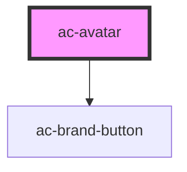

# ac-avatar

<!-- Auto Generated Below -->

## Properties

| Property   | Attribute  | Description | Type          | Default     |
| ---------- | ---------- | ----------- | ------------- | ----------- |
| `href`     | `href`     |             | `string`      | `undefined` |
| `image`    | `image`    |             | `string`      | `undefined` |
| `mode`     | `mode`     |             | `"list-item"` | `undefined` |
| `subtitle` | `subtitle` |             | `string`      | `undefined` |
| `target`   | `target`   |             | `string`      | `undefined` |
| `title`    | `title`    |             | `string`      | `undefined` |

## Dependencies

### Depends on

- [ac-brand-button](../ac-brand-button)

### Graph

----------------------------------------------

*Built with [StencilJS](https://stenciljs.com/)*
